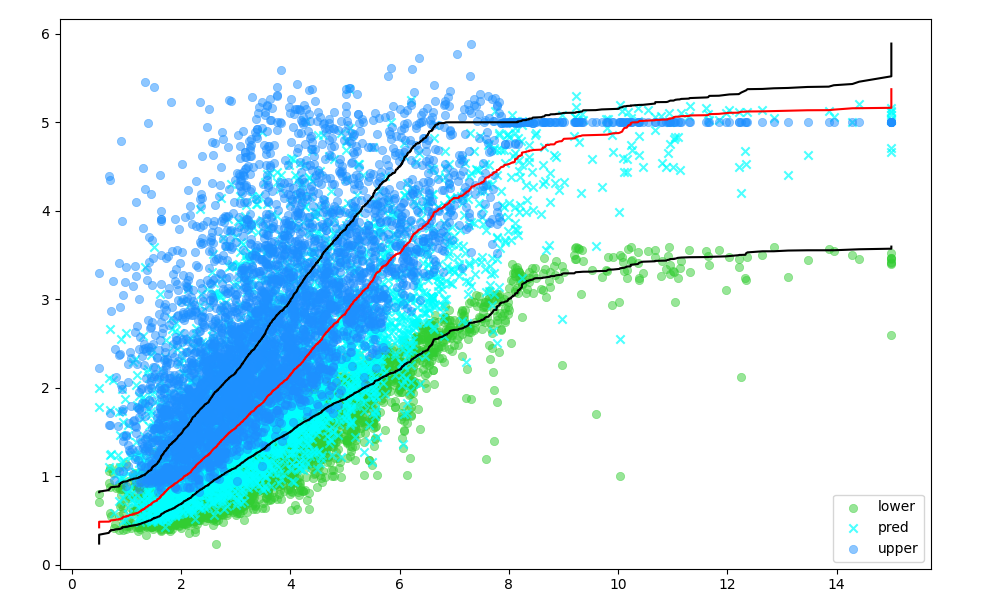

# Prediction Intervals Explained: A LightGBM Tutorial

When we are performing regression tasks, we have the option to generate prediction intervals, which is not the case when doing classification. We generate prediction intervals using quantile regression, which is a fancy way of estimating the median value for a regression value in a specific quantile.

## Background

LightGBM is one of the fastest and most accurate libraries for regression tasks. To add even more utility to the model, they have implemented prediction intervals for the community to be able to give a range of possible values.

Simply put, a prediction interval is just about generating a lower and upper bound on the final regression value. This is incredibly important for some tasks, which we will further elaborate on now.

### Why use them?

We can never be 100% certain about one prediction from one model, so instead, the idea is to give an interval back to a person who ends up controlling the final decision based on the range given by the model. For example, if we are trying to set the price for a house, it is common knowledge that the price is incredibly dependent on how well maintained and renovated it is.

Therefore, we want to give a range - and if the house is poorly maintained, perhaps the price would land in the lower end of the price interval.

### Quantile Regression Explained

In the typical linear regression model, we are tracking the mean difference from the ground truth to optimize the model. However, in quantile regression, as the name suggests, we track a specific quantile (also known as a percentile) against the median of the ground truth.

#### Quantiles & Assumptions

Using the median approach enables us to specify the quantiles. For example, we most often specify that we want the 5% quantile (covering 5% of the data) and the 95% quantile (covering 95% of the data). This gives us a lower and upper boundary that we can use as our smallest and highest estimate in a regression task.

You might ask: Why is it important to estimate these quantiles using the median rather than the mean? The problem with just using the mean is when outliers are present. This can sometimes result in poor predictions because the mean of a group of values heavily emphasizes the outlier values. Therefore, when using the median, we avoid being prone to outliers and end up producing better lower and upper boundaries.

Additionally, unlike Linear Regression, we do not make any assumptions about the distribution of the data, which makes it even more useful and more accurate in certain scenarios.

#### Regression

For linear regression, the following is the equation you will most often see used to make predictions (referring to [objective function](http://ethen8181.github.io/machine-learning/ab_tests/quantile_regression/quantile_regression.html#Objective-Function)):


However, we have to understand this is incredibly "linear" and will only work well for linear problems. The following is the loss function for optimizing the linear regression:


That changes in quantile regression because we need to be able to account for the different quantiles. 

- When the alpha is high (for example, 0.95), the errors that are less than zero receive a lower error value than if they are greater than zero. 
- In reverse, when the alpha is low (for example, 0.05), the errors that are less than zero receive a higher error value than if they are greater than zero, where they will receive a smaller error value.


Now that we have seen how the loss function is calculated for a quantile regression model, we are fully prepared to dive into the Python example prepared for this article.

## Python Example

To make prediction intervals, we need a lower bound and upper bound for the prediction we generate using our model. To generate these bounds, we use the following method:

1. Choose a prediction interval, usually, we set it to 95% or 0.95 — we call this the alpha parameter ($\alpha$) when making prediction intervals.
2. Train your model for making predictions on your dataset.
3. Train two models, one for the lower bound and another for the upper bound. We need to set two parameters for this to work: objective and alpha.

However, to train any model, we first need to find a suitable dataset for our use case, which we will show shortly.

### Data Loading & Preparation

For this article, we have chosen the [California Housing](https://www.dcc.fc.up.pt/~ltorgo/Regression/cal_housing.html) dataset. Below, you can see 4 out of the 8 available features in the dataset with a sample row of data. Upon inspection of the data, we can spot that there are built-in features to help us predict the price of a house, for example, the median income (in thousands of dollars) of the family.

|MedInc|HouseAge|AveRooms|...|Longitude|
|---|---|---|---|---|
|3.2596|33.0|5.017657|...|-117.03|

We only need a few packages to take care of loading the data and preparing it for use in a LightGBM model. For loading and preprocessing the data, we only need the Pandas and Scikit-Learn package:

```python
import pandas as pd
from sklearn.model_selection import train_test_split
from sklearn.datasets import fetch_california_housing
```

To load the data, we define a generic function that takes the data loader object from the Scikit-Learn datasets module. This function will simply load the data and split it into input (x) and output (y) in Pandas data frames.

```python

def sklearn_to_df(data_loader):
    X_data = data_loader.data
    X_columns = data_loader.feature_names
    x = pd.DataFrame(X_data, columns=X_columns)

    y_data = data_loader.target
    y = pd.Series(y_data, name='target')

    return x, y
```

After defining the data loader function, we can call it and get the input and output data, as we just explained. Furthermore, we need to split this into training and testing datasets, so we conveniently use the `train_test_split` function that the Scikit-Learn package comes with.

```python
x, y = sklearn_to_df(fetch_california_housing())

x_train, x_test, y_train, y_test = train_test_split(
    x, y, test_size=0.2, random_state=42)
```

Now that our training and testing data is ready for modelling, we can proceed into the practical example of this article on the prediction intervals using LightGBM.

### Prediction Intervals

We move into the modelling part of the article - and we need a few packages to start with. We need the LightGBM package as that is our model, and then Scikit-Learn and Matplotlib for utilities along the way. Additionally, we load the data from the data loader explained in the previous section.

```python
import lightgbm as lgb
import matplotlib.pyplot as plt
from sklearn.metrics import r2_score
from data_loader import x_train, x_test, y_train, y_test
```

We start by training our regular regression model for predicting the price of the house. This is the standard procedure where we define the model and fit it to the training data (`x_train` and `y_train`). Additionally, we also let the fitted model make predictions on the test set `x_test`

```python
regressor = lgb.LGBMRegressor()
regressor.fit(x_train, y_train)
regressor_pred = regressor.predict(x_test)
```

To train the lower bound model, we specify the quantile and alpha parameter, and then the procedure is exactly the same as when we are training any other LightGBM model.

```python
lower = lgb.LGBMRegressor(objective = 'quantile', alpha = 1 - 0.95)
lower.fit(x_train, y_train)
lower_pred = lower.predict(x_test)
```

The same approach goes for the upper bound model - we specify the quantile and alpha parameter, we train the model, and then finally make predictions.

```python
upper = lgb.LGBMRegressor(objective = 'quantile', alpha = 0.95)
upper.fit(x_train, y_train)
upper_pred = upper.predict(x_test)
```

After this, we still want to check how well our model performs. We only measure our *normal* model and not the upper or lower bound models. This is because the score is unreliable for these quantile regression models since it will tell you the most probable lower or upper prediction. Essentially, that would mean we could get an r-squared score of 0.3 without being able to use this as our final score of the model.

```python
score = r2_score(y_test, regressor_pred)
print(score)
```

Finally, we get the r-squared score of 0.836, which is decent for a regression model.

To wrap up the article, we will shortly describe how to plot the final values of the model. 

The first few lines (1-5) create the plot and "scatter" our data points by the test feature "MedInc" and the house price together on our coordinate system. We mark the lower bound with a green color, the regression model's predictions with the aqua/teal color, and our upper bound with a strong dodger blue. 

Additionally, we want to plot a line through the middle of all the points to distinguish where we would normally cut off the lower and upper bounds when making a final decision on the price of a house. Therefore, we use the plot function and make sure to sort both the MedInc test feature and the predictions so that they fit into the plot.

```python
plt.figure(figsize=(10, 6))

plt.scatter(x_test.MedInc, lower_pred, color='limegreen', marker='o', label='lower', lw=0.5, alpha=0.5)
plt.scatter(x_test.MedInc, regressor_pred, color='aqua', marker='x', label='pred', alpha=0.7)
plt.scatter(x_test.MedInc, upper_pred, color='dodgerblue', marker='o', label='upper', lw=0.5, alpha=0.5)
plt.plot(sorted(x_test.MedInc), sorted(lower_pred), color='black')
plt.plot(sorted(x_test.MedInc), sorted(regressor_pred), color='red')
plt.plot(sorted(x_test.MedInc), sorted(upper_pred), color='black')
plt.legend()

plt.show()
```

Finally, we produce the actual chart and show it below. Everything that we just described is something that you can see. The x-axis is the MedInc feature and the y-axis is the house price prediction:



## Conclusion

In this article, you learned both the theoretical and practical approaches to making a regression model that includes the upper and lower bounds to form prediction intervals. Additionally, this will now be in your toolbox when you need to perform regression tasks in the future on other datasets.

## References

1. IBM has some short explanations on quantile regression: [IBM - Regression Quantile](https://www.ibm.com/docs/en/spss-statistics/27.0.0?topic=regression-quantile)
2. Ethen8181, a GitHub user, has a nice Jupyter Notebook with small explanations of the math and the equivalent implementation: [Ethan8181 - Quantile Regression](http://ethen8181.github.io/machine-learning/ab_tests/quantile_regression/quantile_regression.html)
3. Ceshine Lee gives great explanations on quantile regression including code in Tensorflow and Pytorch: [Ceshine Lee - Quantile Regression Part 2](https://medium.com/the-artificial-impostor/quantile-regression-part-2-6fdbc26b2629)
4. Wikiwand has a great introduction explanation to quantile regression: [Wikiwand - Quantile Regression](https://www.wikiwand.com/en/Quantile_regression)
